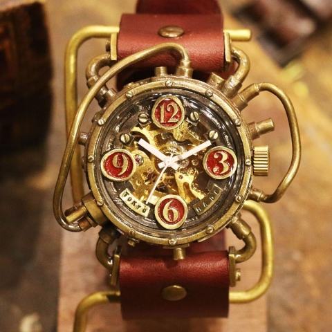

# Continuum Breaking Watch

*Wondrous Item, Legendary*

From the Laboratory of Continuism, the Continuum Breaking Watch is designed to allow you to exceed the boundaries of time. When not in use, the watch functions as a normal watch, and is made of gold, bronze and leather. The inner gears of the watch are visible behind the watch face.

The watch has 4 charges, and regains 1d4 expended charges daily at dawn. As a free action on your turn, you may expend a number of charges to use the watches power to different degrees. The number of charges and the effect the watch has is laid out in the table below. If the action you choose brings the watch below zero charges, the watch becomes unusable until it is repaired by an Izzet engineer or the Mending Spell.

| Charges | Effect |
|---------|--------|
| 1 | Time has instantly become slower for you, and you are able to take an extra bonus action on your turn and an extra reaction for the next 1d4 rounds, beggining with your current turn and the current round. |
| 2 | You watch the world around you move in super slow motion, allowing you to see movements as though they are barely moving at all. For the next 1d4 rounds, you may take an extra action on your turn. Treat any attacks you make during this time as though your opponent is Stunned. Attacks made against you during this time have disadvantage, as you are nothing more than a blur to their eyes. |
| 3 | Time all but stops for you. You can take up to 1d4 turns in a row where you can use actions and move as normal. Treat any attacks you make during this turn as though your opponent is Stunned, Blinded, and Deafened, as you are literally inconceivable to those around you. |

