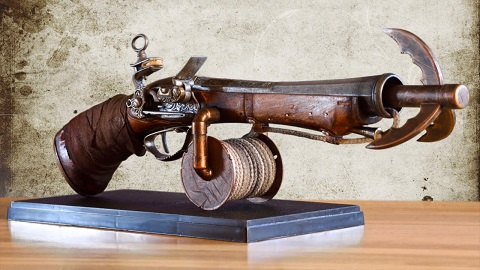

# Mizzium Grappling Hook

*Wondrous Item, Uncommon*

From the Laboratory of Metallurgy, the Mizzium Grappling Hook can be mounted on a mizzium apparatus to free up hands, though you must have a free hand to operate and climb with it. Consists of a mizzium grappling hook and 60ft of rope. It can be shot as an action and if hooked on top of a wall can give a climbing speed of half of your movement. A bonus action can be used to retract the hook if it is not lodged in something. A bonus action can be taken by the user or someone it is lodged on to remove it. If used to climb, it does not need to be retracted if the user climbs to where the hook is lodged.

