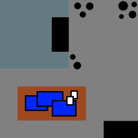

# Context
_This takes place just before the current mission the team is on._

Opi is currently visiting his mother in Precinct 1, so he is unavailable for this task.

# Story
The group is walking on Tin St near Precinct 5 approached by a [soldier](#soldier) who Seli may recognize for working as a guard as one of the Selesnya tents. The guard recognizes them and is frantic, asking for help. He looks beaten up and keeps saying something about being asked to investigate a house and a drake. If the group chooses to follow him, he leads them to a house in the blistercoils. 

There are windows with closed curtains that are unable to be opened. The bathroom window is 10ft off the ground and unobstructed, but just looks into an empty bathroom with the door closed. The front door is closed but unlocked, upon entering, a [blue guard drake](#blue-guard-drake) springs out from behind a chair and attacks the first player. Combat until drake is killed or subdued. If the soldier is alive after the combat, he will calm down and tell the party he was supposed to investigate a suspicious person who lived here. The guy apparently has made threats to some of the professors at Prism University and the Azorius wanted to find out more so they sent him to investigate the house but he got his ass kicked by the guard drake. The guard drake has a name tag (Dylan).

Investigation of 10 or higher in the bedroom (desk) will reveal the resident(Eric) was a former Prism University student who got kicked out for bad grades and behavior. There is also a key in the desk drawer. Perception of 12 or higher in the living room  will reveal the rug on the floor has been burned, pulling the rug back reveals a trapdoor. The trapdoor is locked and the key can be found in the desk drawer (it can also be picked with a DC11 Sleight of Hand). The trapdoor has a weak glyph of warding that can be detected by a DC 14 Investigation check or a detect magic spell. The glyph requires a verbal password (Dylan). If the glyph is triggered, everyone in a 10ft radius takes 3d6 lightning damage.

The trapdoor leads to downward steps into a dimly lit 20x20 room with a 10x10 metal walled cage in the back left corner. The door to the cage is open and both inside and outside of the case are buckets of water and rocks. There is a large desk with documents on it. The documents are instructions for creating a [blistercoil weird](#blistercoil-weird-tecca) and blueprints of Prism University and Ismeri Library. There is a calendar on the wall with the current date circled. Hopefully they deduce hes taken a blistercoil weird to the school with ill intent and head that way.

Its ~20min to the school and outside, they run into Connors character who says he thought he saw a blistercoil go into the library. There is a [scorchbringer guard](#scorchbringer-guard) ducked behind a bush in front of the library who will join the party in the fight if engaged with. He is hesitant to use his scorchbringer and lets the party know not to hit the blistercoil with fire or it will grow. Looking into to the library will reveal a blistercoil weird near the back of the library and some bookshelves knocked over and on fire. The library is 200x60 and 50ft tall. There is an elevated section at the back that is 20ft off the ground with stairs leading up to it from both sides. The bookshelves on the ground floor are 30ft tall and there are groups of tables at the front left and right. The bookshelves on the second floor are 20ft tall with groups of tables in front of them. Under the second floor at the back are more bookshelves that touch the ceiling(20ft) and 2 study rooms that are 15x20.

The first row of bookshelves has been mostly knocked over and are starting to catch fire, one other bookshelf near the weird is on fire but still standing. [Eric](#mage-eric) is looking down on the chaos laughing from the second floor balcony. The guard lets the party know that the books in here are very valuable so they should try to save as many as they can, and try to take Eric alive if possible. Combat ensues, using the falling bookshelves as obstacles and difficult terrain. Eric will mostly attempt to run from the party and destroy more of the library rather than fight back. 

After combat the guard and firefighters will arrive, the party can choose to hand Eric over to the guard or kill him. If he is returned alive, the party will receive 200 gold, if he is dead, the party receives 50 gold.

# Stat Blocks

## Soldier
Medium Humanoid (Any Race), Any
Armor Class: 18 (Chain Mail, Shield)
Hit Points: 5 (max 16)
Speed: 30 ft.
| STR | DEX | CON | INT | WIS | CHA |
|---------|---------|---------|--------|--------|--------|
| 13 (+1) | 12 (+1) | 12 (+1) | 10 (0) | 11 (0) | 11 (0) |

Skills: Athletics +3, Perception +2
Senses: Passive Perception 12
Languages: Any one language (usually Common)
Challenge 1/2 (100 XP)
_Formation Tactics._ The soldier has advantage on saving throws against being charmed, frightened, grappled, or restrained while it is within 5 feet of at least one ally.

**Actions**

Multiattack. The soldier makes two melee attacks.

Longsword. Melee Weapon Attack: +3 to hit, reach 5 ft., one target. Hit: 6 (1d8 + 2) slashing damage, or 7 (1d10 + 2) slashing damage if used with two hands.

## Blue Guard Drake
Medium Dragon, Unaligned
Armor Class: 14 (natural armor)
Hit Points: 45 (max 52)
Speed: 30ft.
| STR | DEX | CON | INT | WIS | CHA |
|---------|--------|---------|--------|--------|--------|
| 16 (+3) | 11 (0) | 16 (+3) | 4 (-3) | 10 (0) | 7 (-2) |

Skills: Perception +2
Damage Resistances: lightning
Senses: darkvision 60 ft., passive perception 12
Languages: understands Draconic but cant speak it
Challenge 2 (250XP)

**Actions**

Multiattack. The drake attacks twice, once with its bite and once with its tail.

Bite. Melee Weapon Attack: +5 to hit, reach 5 ft., one target. Hit: 7 (1d8 + 3) piercing damage.
Tail. Melee Weapon Attack: +5 to hit, reach 5 ft., one target. Hit: 6 (1d6 + 3) bludgeoning damage.

## Scorchbringer Guard
Medium humanoid, Chaotic Neutral
Armor Class: 16 ( breastplate)
Hit Points: 15 (max 15)
Speed: 30ft.
| STR | DEX | CON | INT | WIS | CHA |
|---------|---------|--------|--------|--------|--------|
| 13 (+1) | 14 (+2) | 10 (0) | 9 (-1) | 10 (0) | 10 (0) |

Senses: passive perception 9
Languages: Common
Challenge 1/2

**Traits** 

Explosive Tank. When the guard dies, or if it rolls a 1 when checking whether its Scorchbringer action recharges, the tank on its back explodes in a 10-foot radius sphere. Each creature in that area must make a DC12 Dexterity saving throw, taking 7 (2d6) fire damage on a failed save, or half as much damage on a successful one. The explosion ignites flammable objects that aren't being worn or carried, and it destroys the scorchbringer.

Has 2 Potion of Healing (2d4 + 2) that can be used on himself or the party. Will prioritize healing the party since he doesn't want to make the blistercoil worse.

**Actions**

Light Hammer. Melee or Ranged Weapon Attack: +4 to hit, reach 5 ft. or range 20/60 ft., one target. Hit: 4 (1d4 + 2) bludgeoning damage.

Scorchbringer - Recharge 4. The guard's scorchbringer spouts a stream of flame in a line that is 30 feet long and 5 feet wide. Each creature in the line must make a DC: 12 Dexterity saving throw, taking 7 (2d6) fire damage on a failed save, or half as much damage on a successful one.

## Blistercoil Weird (Tecca)
Medium Elemental, Chaotic Neutral
Armor Class: 13
Hit Points: 45 (max 45)
Speed: 40ft., swim 60ft.
| STR | DEX | CON | INT | WIS | CHA |
|---------|---------|---------|--------|--------|--------|
| 16 (+3) | 16 (+3) | 15 (+2) | 10 (0) | 5 (-2) | 7 (-2) |

Damage Resistances: cold, fire; and bludgeoning, piercing and slashing from non-magical attacks
Damage Immunities: poison
Condition Immunities: exhaustion, grappled, paralyzed, petrified, poisoned, prone, restrained, unconscious
Senses: darkvision 60 ft., passive perception 10
Languages: Draconic
Challenge 4 (1100XP)

**Traits**

_Feed on Fire._ If the weird takes fire damage from a spell or other magical effect, its size increases by one category. If there isn't enough room for the weird to increase in size, it attains the maximum size possible in the space available. While the weird is Large or bigger, it makes Strength checks and saving throws with advantage. If the weird starts its turn at Gargantuan size, the weird releases energy in an explosion. Each creature within 30 feet of the weird must make a DC12 Dexterity saving throw, taking 28 (8d6) fire damage on a failed save, or half as much damage on a successful one. The explosion ignites flammable objects in the area that aren't being worn or carried. The weird then becomes size Medium.

_Form of Fire and Water._ The weird can move through a space as narrow as 1 inch wide without squeezing. In addition, the weird can enter a hostile creature's space and stop there. The first time the weird enters another creature's space on a turn, that creature takes 5 (1d10) fire damage and catches fire; until someone takes an action to douse the fire, the burning creature takes 5 (1d10) fire damage at the start of each of its turns.

_Heated Body._ A creature that touches the weird or hits it with a melee attack while within 5 feet of it takes 5 (1d10) fire damage.

_Illumination._ The weird sheds bright light in a 30-foot radius and dim light for an additional 30 feet.

**Actions**

Slam. Melee Weapon Attack: +5 to hit, reach 5 ft., one target. Hit: 7 (1d8 + 3) bludgeoning damage plus 7 (2d6) fire damage, or 11 (2d8 + 3) bludgeoning damage plus 14 (4d6) fire damage if the weird is Large or bigger.

## Mage (Eric)
Medium humanoid (any race), Neutral Evil

Armor Class 15 (mage armor)
Hit Points 40 (max 40)
Speed 30 ft.

| STR | DEX | CON | INT | WIS | CHA |
|--------|---------|---------|--------|--------|--------|
| 9 (-1) | 14 (+2) | 11 (+0) | 17 (+3) | 12 (+1) | 11 (+0) |
					
Saving Throws: Int +6, Wis +4
Skills: Arcana +6, History +6
Senses: passive Perception 11
Languages: Common, Draconic, Vedalken(poor)
Challenge 5 (2,000 XP)

Special Traits

**Spellcasting**

Level 8 wizard, spell save DC 14, +6 to hit with spell attacks. The mage has the following spells prepared:

- Cantrips (at will):
    - fire bolt
    - light
    - mage hand
    - prestidigitation
- First level (4 slots)(1 used):
    - expeditious retreat
    - mage armor
    - magic missile 
    - shield
    - absorb elements
- Second level (3 slots):
    - misty step
    - mirror image
- Third level (3 slots):
    - counterspell
    - fireball
    - fly
- Fourth level (2 slots)(1 used):
    - greater invisibility
    - death ward

**Actions**

Dagger: Melee or Ranged Weapon Attack: +5 to hit, reach 5 ft. or range 20/60 ft., one target. Hit: 1d4 + 2 piercing damage.

# Maps

## Eric's House

## Eric's Workshop

## Library Top Floor

## Library Bottom Floor
